# How the forecaster works — a walkthrough

This is the loop, end to end, on real data, for one hazard in one place — and
then the same loop on two others. Every screenshot and transcript below was
captured by [`tools/demo/capture.py`](../tools/demo/capture.py): it runs the
real `readiness` command line in a headless Chromium session against the
committed data, saves what came out, and assembles the recordings from those
frames. Nothing is mocked. Regenerate everything with `make docs-capture`
(see [the last section](#regenerating-these-captures)).

The walkthrough uses the `tornado-ok` contract: damaging tornadoes, Oklahoma
counties, quarterly. It could equally be any registered contract — that is
the point of [contracts as data](contracts.md).

```
contract (JSON) ──► data plane ──► labelled panel ──► models ──► harness ──► ledger
 hazard, scope,     Storm Events    region × period   propose    score,      hash-chained,
 period, damage,    + Census        binary labels               screen,     one per contract
 splits, thresholds + NWS zones                                  judge
```

---

## 1. See what is registered

A fresh clone ships three contracts. `readiness contracts` lists them with
their hazard, scope, period and the hash of their criteria.

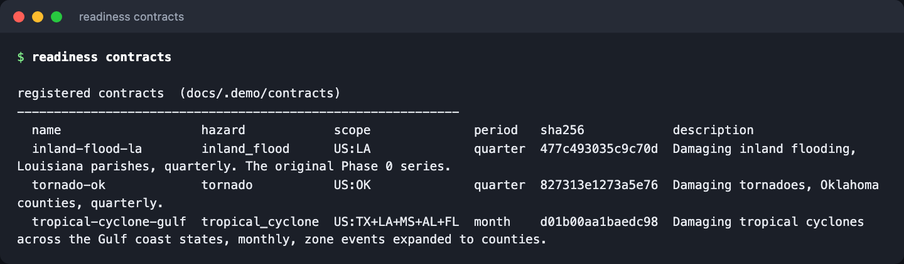

```
  name                   hazard            scope              period   sha256            description
  inland-flood-la        inland_flood      US:LA              quarter  477c493035c9c70d  Damaging inland flooding, Louisiana parishes, quarterly. ...
  tornado-ok             tornado           US:OK              quarter  827313e1273a5e76  Damaging tornadoes, Oklahoma counties, quarterly.
  tropical-cyclone-gulf  tropical_cyclone  US:TX+LA+MS+AL+FL  month    d01b00aa1baedc98  Damaging tropical cyclones across the Gulf coast states, ...
```

The hash is the load-bearing detail. It is computed over every criterion in
the contract — hazard, event types, scope, period, damage definition, zone
policy, splits, touch budget, thresholds — and stamped on every experiment
card. Change a criterion and every prior experiment becomes visibly
incomparable.

## 2. Read a contract

`readiness contract -c tornado-ok` prints the contract in full: the forecast
unit, what "damaging" means, the locked splits, and the three clauses a
model must clear.

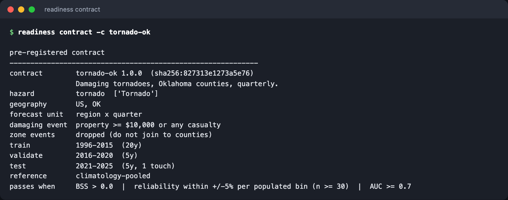

```
contract        tornado-ok 1.0.0  (sha256:827313e1273a5e76)
                Damaging tornadoes, Oklahoma counties, quarterly.
hazard          tornado  ['Tornado']
geography       US, OK
forecast unit   region x quarter
damaging event  property >= $10,000 or any casualty
zone events     dropped (do not join to counties)
train           1996-2015  (20y)
validate        2016-2020  (5y)
test            2021-2025  (5y, 1 touch)
reference       climatology-pooled
passes when     BSS > 0.0  |  reliability within +/-5% per populated bin (n >= 30)  |  AUC >= 0.7
```

The forecast unit is therefore: *the probability that at least one damaging
tornado is recorded in a given Oklahoma county in a given quarter*. The
`test` split may be scored once per model version, ever, and the budget is
kept on disk, not in memory.

## 3. Register a new one

Nothing about a hazard or a place lives in code. To run the loop on Kansas
hail, register a contract:

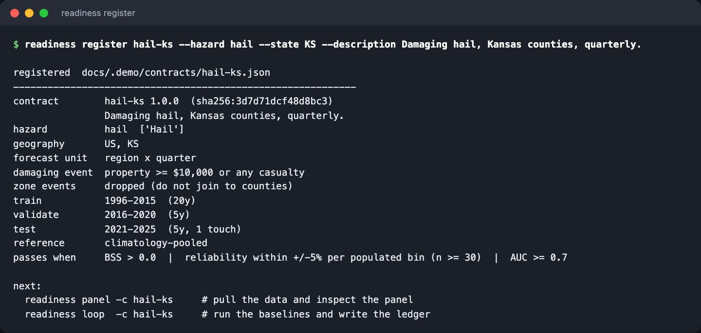

`register` validates before it writes — splits must be disjoint, contiguous
and ordered in time, nothing may start before 1996, the hazard must be in the
catalogue (`readiness hazards`) or come with explicit Storm Events event
types — and then prints the contract, its hash, and the two commands that
come next. (The walkthrough registers into a scratch copy of the registry,
which is why the path reads `docs/.demo/...`.)

For a hazard that Storm Events codes against forecast zones rather than
counties — heat, tropical cyclones, winter storms, wildfire — add
`--zone-policy expand`; see [contracts.md](contracts.md#zone-coded-hazards-and-zone_policy).

## 4. Build the panel

`readiness panel` pulls and pins whatever data is missing, builds the dense
region × period panel, and reports where every one of the hazard's events
went.

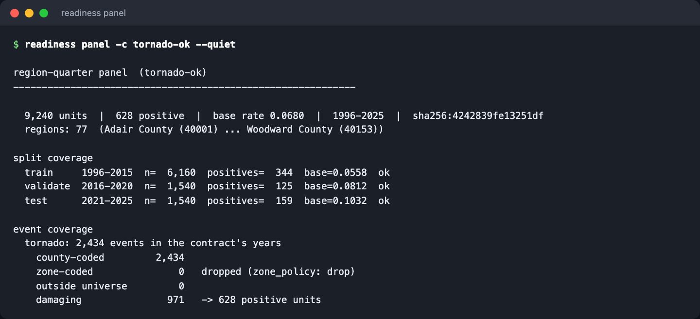

Three things to read here:

- **The panel is dense.** 77 counties × 30 years × 4 quarters = 9,240 units,
  every one of them labelled 0 or 1. Storm Events only records events; the
  Census county file supplies the zeros.
- **The splits are covered**, and their base rates differ: 5.6% in training,
  8.1% in validation, 10.3% in the untouched test years. A model calibrated
  on 1996–2015 will be under-confident later — visible now, before any model
  exists, because the panel is dense and the splits are locked.
- **Event coverage.** Of 2,434 tornado events in range, all are county-coded,
  971 are damaging under this contract's definition, and they mark 628
  distinct county-quarters. For a zone-coded hazard this block is where the
  under-count would show, with a warning.

## 5. Score one model

`readiness score` fits one model on the training years, forecasts the
validate years, and produces the full scorecard, the verdict, and the leakage
screen — always all three together.

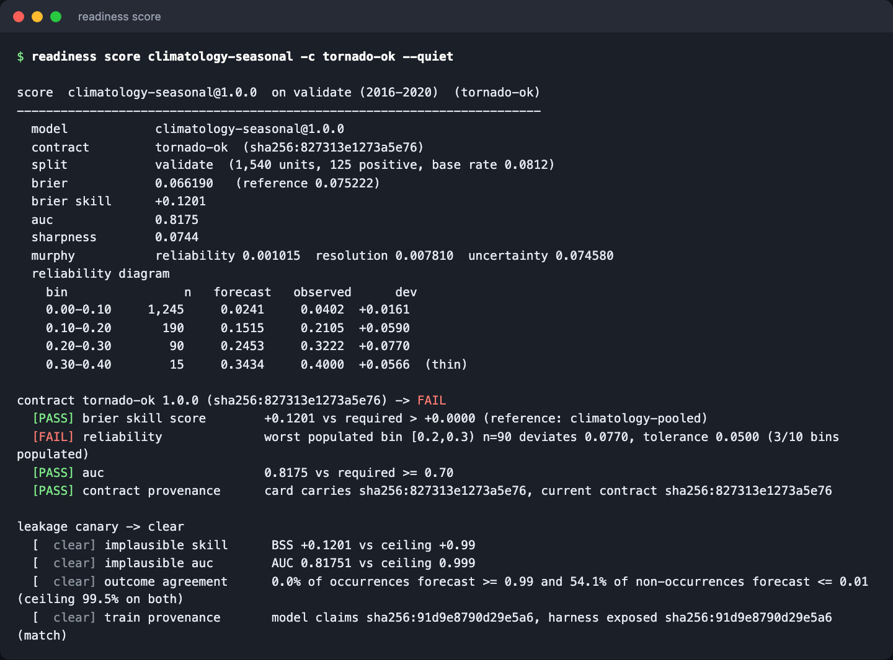

The seasonal climatology — a per-county, per-quarter frequency shrunk toward
the state-wide seasonal rate — has real skill on tornadoes: BSS +0.12 against
the pooled reference and AUC 0.82. It still **fails** the contract, on
calibration: in the 0.2–0.3 bin it forecast 0.245 and 0.322 was observed, a
7.7-point miss where the contract allows 5. The reliability table is the
diagram in numbers; the [dashboard](#7-read-the-ledger) draws it.

The canary is clear on all four checks, and says why in each case.

## 6. Run the loop

`readiness loop` is *gather context → take action → verify work → repeat*
over a fixed queue of candidate models, writing one sealed experiment card
per candidate into the contract's own ledger. Here it is running — a replay
of the captured transcript, not a mock-up:

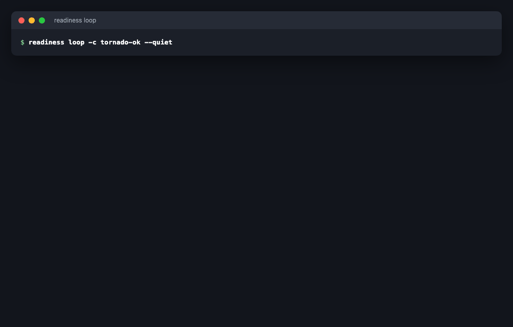

And the finished run:

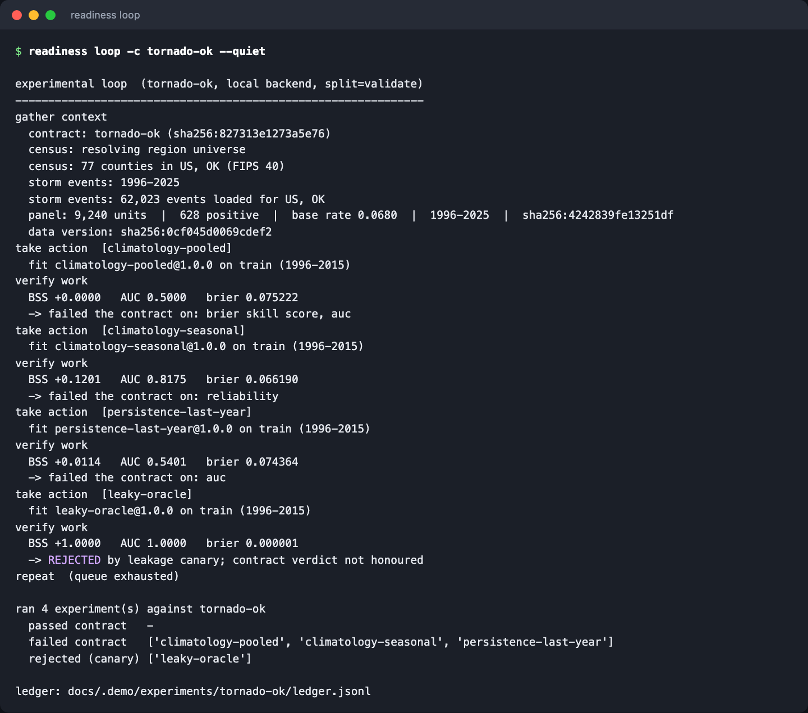

Read the four cards as assertions about the harness:

1. **`climatology-pooled` scores exactly +0.0000 / 0.5000.** It is the
   reference forecast scored against itself; any other number would mean the
   yardstick is bent. It fails the contract anyway, because *being*
   climatology is not *beating* it.
2. **`climatology-seasonal` beats it and still fails**, on the calibration
   clause, as in step 5.
3. **`persistence-last-year`** — a sharp, fixed-level forecast — gains a
   little skill on tornadoes and fails on discrimination.
4. **`leaky-oracle`** is a model constructed with direct access to the
   outcomes it is scored on. It posts a perfect score and is **REJECTED**.
   This is the Phase 0 exit criterion.

The transcript is in [media/transcripts/loop.txt](media/transcripts/loop.txt).

## 7. Read the ledger

`readiness ledger` prints the summary table and verifies the hash chain:
every card carries the hash of the card before it, and the head hash and
card count are anchored in a committed sidecar file, so neither an edit in
the middle nor a deletion from the end goes unnoticed.

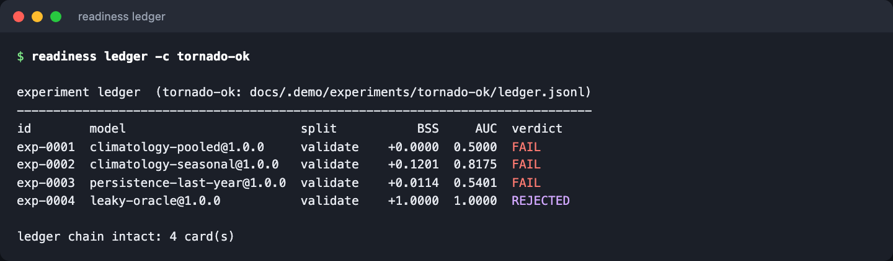

`readiness dashboard` renders the same ledger as a self-contained page — no
JavaScript, no external assets — with a reliability diagram per experiment:

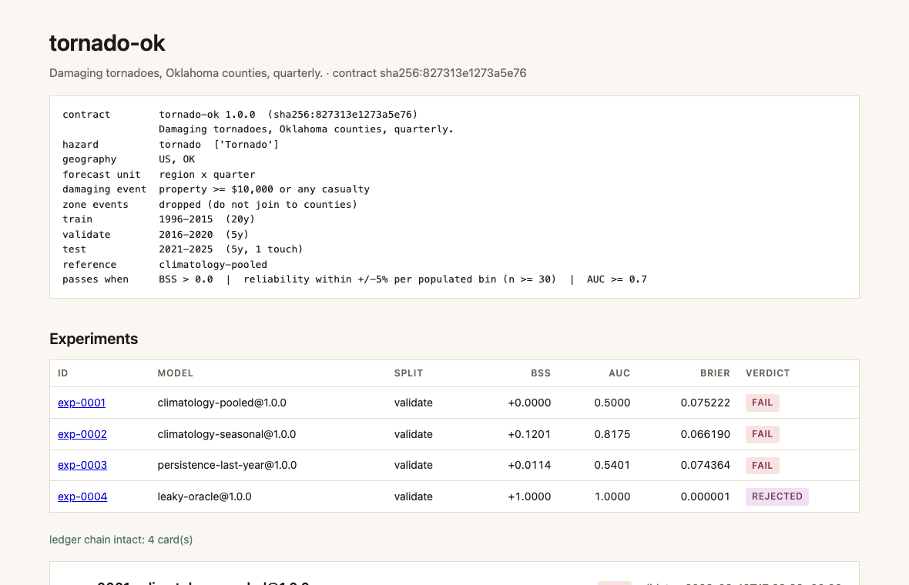

The seasonal model's card shows the calibration failure as a shape: the
0.1–0.2 and 0.2–0.3 bins sit above the diagonal, outside the shaded ±5-point
tolerance band, while the big 0.0–0.1 bin sits just inside it.

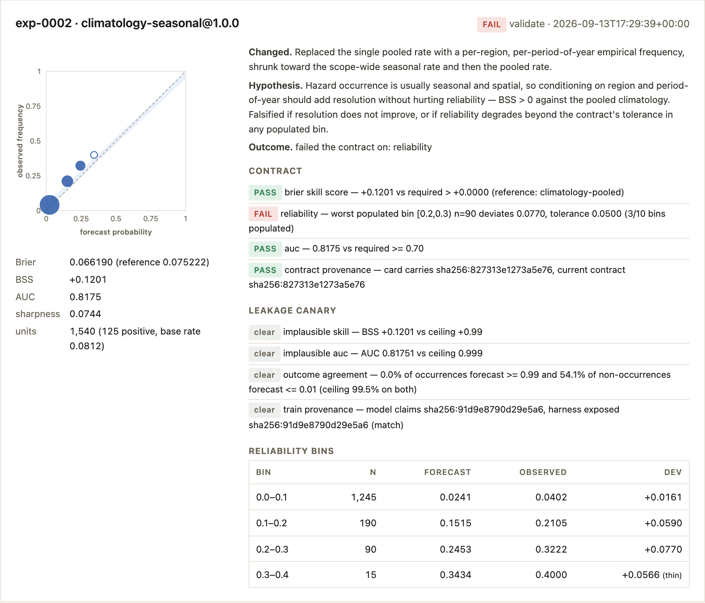

## 8. Verify the exit criteria

`readiness verify` checks the two Phase 0 exit criteria for the contract:
the climatology baselines reproduce bit-for-bit against the blessed
fingerprints in `harness_expected/`, and the harness rejects the leaked
model. It also re-verifies the ledger chain.

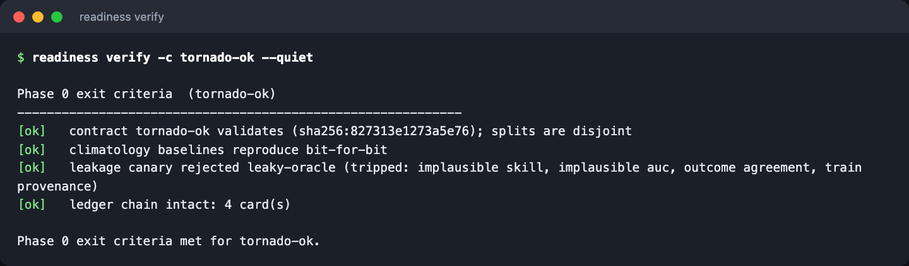

```
[ok]   contract tornado-ok validates (sha256:827313e1273a5e76); splits are disjoint
[ok]   climatology baselines reproduce bit-for-bit
[ok]   leakage canary rejected leaky-oracle (tripped: implausible skill, implausible auc, outcome agreement, train provenance)
[ok]   ledger chain intact: 4 card(s)

Phase 0 exit criteria met for tornado-ok.
```

## 9. Watch the canary catch a cheat

`readiness canary` runs the leaked model on its own and shows both halves of
the argument: the contract, *if it were honoured*, would pass this model on
every clause — and the canary rejects it on every check.

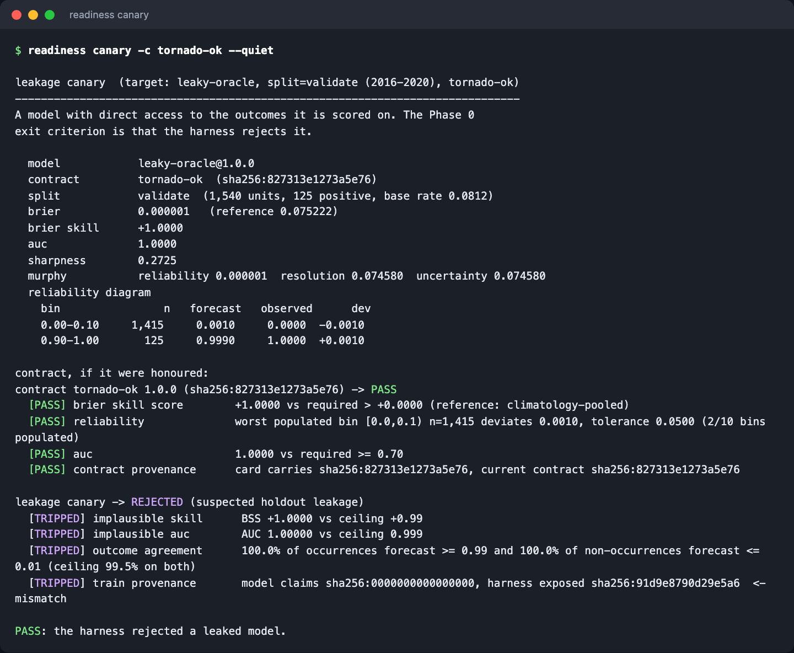

The canary is a smoke alarm over the model's output, not a proof. The real
defence is structural: a model receives a `TrainingView` over training years
only, `predict()` is handed bare units, and labels are fetched after it
returns. The canary is for when that structure is breached by an accidental
join or a file that should not have been read.

## 10. The same harness, three hazards

Nothing above was specific to tornadoes or to Oklahoma. The three committed
contracts differ in hazard, scope, period and zone policy, and the same
seasonal model lands differently on each:

<table>
<tr>
<th>inland-flood-la<br><small>flood · 64 parishes · quarterly</small></th>
<th>tornado-ok<br><small>tornado · 77 counties · quarterly</small></th>
<th>tropical-cyclone-gulf<br><small>tropical cyclone · 534 counties · monthly · zones expanded</small></th>
</tr>
<tr>
<td>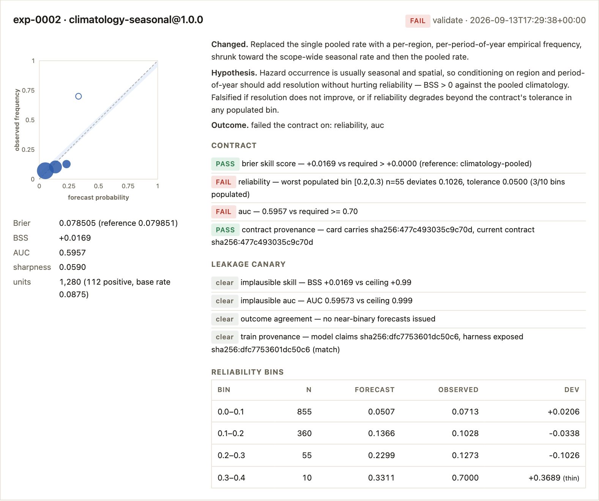</td>
<td></td>
<td>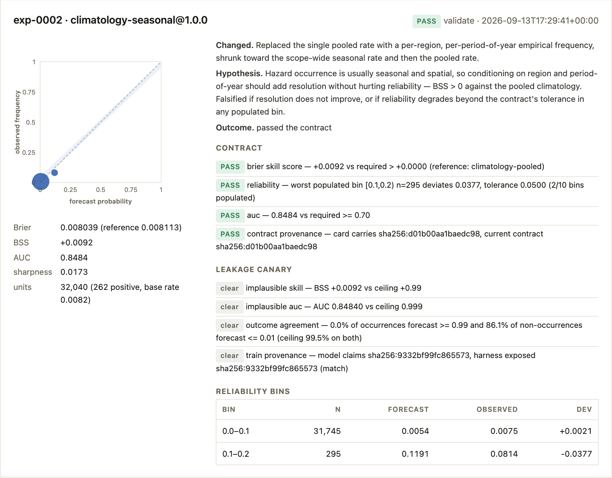</td>
</tr>
</table>

- On **inland flooding** it has slight skill (+0.017) but fails both
  reliability and the AUC floor.
- On **tornadoes** it discriminates well and fails only on calibration.
- On **monthly tropical cyclones** it *passes*: the season is so sharp that
  region plus month clears every clause. Its skill score is +0.009, because
  at a 0.66% base rate the pooled reference is already nearly right nearly
  everywhere. A passing contract is permission to spend one test touch, not
  a forecast.

Running the same canary across base rates from 8% down to 0.66% is also what
exposed — and fixed — a check that had been implicitly calibrated to one
hazard (see the [README](../README.md#examples)).

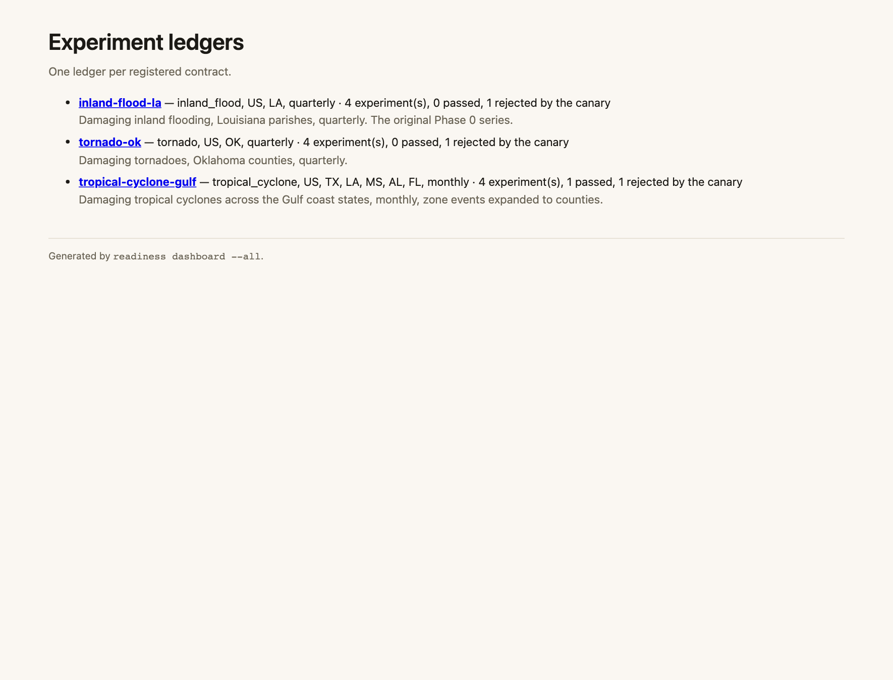

## 11. Phase 1: features and the promotion

Everything above is Phase 0: the harness, with no forecasting model. Phase 1
adds the feature channel, four candidate models, the one atomic test touch
and the published backtest. No captured transcript of it exists yet — the
captures on this page are regenerated by `tools/demo/capture.py` with the
pinned data, and the Phase 1 commands need the feature extracts on disk
(`readiness snapshot -c tornado-ok --features era5,terrain`), so their
transcripts arrive with the real-data run. The commands, in the order the
exit check runs them:

**Load and audit the features.** The harness owns the feature channel
([features.md](features.md)): sources hand over raw series and static
tables, the harness computes every cutoff, and every source is admitted or
refused before anything is built.

```bash
readiness features -c tornado-ok --features era5,terrain
readiness features -c tornado-ok --features era5,terrain,nri   # NRI refused, on purpose
```

The first prints each loaded source with its admission verdict, the columns
of every feature set those sources can build, and the audit over the
validate units — admission, the poisoned-cutoff bound, coverage. The second
adds FEMA's National Risk Index and prints its refusal as a finding: the
v1.20 layer encodes data through 2023, and the contract validates from 2016.
The command still exits 0; the refusal is the firewall working, not a fault.

**Run the Phase 1 queue.** `--queue phase1` runs the baselines and then the
feature candidates — `logistic` history-only, `logistic` with ERA5, with ERA5
and terrain, `logistic+iso`, `gbm`, `gbm+iso` — each on `validate`, each
writing a card whose `data_snapshot` records the constructor arguments, the
feature columns and the audit. A candidate whose sets need a source that was
not loaded is skipped with a progress line, not a card.

```bash
readiness loop -c tornado-ok --queue phase1 --features era5,terrain
readiness ledger -c tornado-ok
```

**Promote: the one test touch.** When a validate card has PASSED with a
clear canary, and only then, the same model with the same arguments may be
scored on the test years — once. `promote` refuses without that card,
refuses if any test card already exists under the contract digest, charges
the budget before it scores, and writes the test card through the same
`run_experiment` the loop uses. `score --split test` is refused and points
here.

```bash
readiness promote logistic -c tornado-ok --features era5,terrain --spend-test-touch
```

(`readiness loop --queue phase1 --promote` does the same for the first
candidate in queue order whose validate card passed.)

**Publish and verify.** The backtest report is rendered from committed files
only ([backtest.md](backtest.md)); the Phase 1 check is ledger-only.

```bash
readiness backtest -c tornado-ok
readiness verify -c tornado-ok --phase 1
readiness verify -c tornado-ok --phase 1 --replay   # refit from the card, rescore test, no touch spent
```

`verify --phase 1` exits 0 only if the chain and anchor are intact; exactly
one test card exists under the current contract digest and it is the
*first* test card in the ledger; its verdict re-derives from the stored
scorecard; the canary did not reject it; the feature audit was clean; an
earlier validate PASS exists for the same model, version and arguments;
`test_touches.json` shows one touch; and `backtest.html` embeds that card's
hash and the ledger head. `--replay` additionally rebuilds the dataset,
refits the promoted model from the card's `model_kwargs` and rescores it on
test without spending the budget, comparing to the card at 12 significant
figures. `make phase1 CONTRACT=tornado-ok` chains snapshot, features, the
loop with `--promote`, the report and the check.

A failed first touch is published too, and the contract cannot exit Phase 1;
the sanctioned next move is a new contract, never a relaxed threshold or a
second touch.

## 12. The research briefing

The design the implementation follows is in [`report/index.html`](../report/index.html)
(`make serve` to read it locally). Its second section is the argument for
the planning layer that the risk numbers exist to serve:

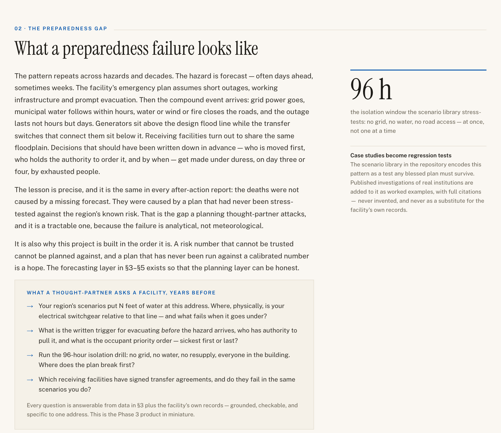

## Regenerating these captures

```bash
pip install -e '.[docs]'          # playwright + pillow, docs-only extras
playwright install chromium
readiness snapshot -c tornado-ok  # the demo needs the pinned data locally
make docs-capture
```

`tools/demo/capture.py` copies the registry to `docs/.demo/contracts`, points
the CLI at an empty `docs/.demo/experiments`, runs the ten commands above,
saves each transcript to `docs/media/transcripts/`, renders it in a terminal
frame and screenshots it; renders the committed example ledgers with
`readiness dashboard` and screenshots their reliability diagrams; screenshots
the report; and replays the loop transcript frame by frame into `loop.gif`.
The scratch directory is deleted afterwards and the committed ledgers are
never touched.
